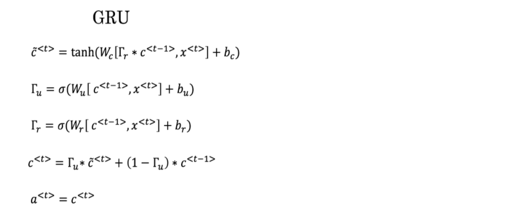

# Recurrent Neural Networks

1. Suppose your training examples are sentences (sequences of words). Which of the following refers to the jth word in the ith training example?

	- [x] x(i)\<j> 
	- [ ] x\<i>(j) 
	- [ ] x(j)\<i> 
	- [ ] x\<j>(i) 

2. Consider this RNN:

This specific type of architecture is appropriate when:  
	- [x] Tx = Ty  
	- [ ] Tx < Ty  
	- [ ] Tx > Ty  
	- [ ] Tx = 1  

3. To which of these tasks would you apply a many-to-one RNN architecture? (Check all that apply).
  
	- [ ] Speech recognition (input an audio clip and output a transcript)  
	- [x] Sentiment classification (input a piece of text and output a 0/1 to denote positive or negative sentiment)  
	- [ ] Image classification (input an image and output a label)  
	- [x] Gender recognition from speech (input an audio clip and output a label indicating the speaker’s gender)  

4. You are training this RNN language model.

At the tth time step, what is the RNN doing? Choose the best answer.  
	- [ ] Estimating P(y\<1>, y\<2>, ...., y\<t-1>)
	- [ ] Estimating P(y\<1>)
	- [x] Estimating P(y\<t> | y\<1>, y\<2>, ...., y\<t-1>)
	- [ ] Estimating P(y\<t> | y\<1>, y\<2>, ...., y\<t>)

5. You have finished training a language model RNN and are using it to sample random sentences, as follows:
 
What are you doing at each time step t?

	- [ ] (i) Use the probabilities output by the RNN to pick the highest probability word for that time-step as y\<t>. (ii) Then pass the ground-truth word from the training set to the next time-step.
	- [ ] (i) Use the probabilities output by the RNN to randomly sample a chosen word for that time-step as y\<t>. (ii) Then pass the ground-truth word from the training set to the next time-step.
	- [ ] (i) Use the probabilities output by the RNN to pick the highest probability word for that time-step as y\<t>. (ii) Then pass this selected word to the next time-step.

	- [x] (i) Use the probabilities output by the RNN to randomly sample a chosen word for that time-step as y\<t>. (ii) Then pass this selected word to the next time-step.

6. You are training an RNN, and find that your weights and activations are all taking on the value of NaN (“Not a Number”). Which of these is the most likely cause of this problem?
	- [ ] Vanishing gradient problem.
	- [x] Exploding gradient problem.
	- [ ] ReLU activation function g(.) used to compute g(z), where z is too large.
	- [ ] Sigmoid activation function g(.) used to compute g(z), where z is too large.
	
7. Suppose you are training a LSTM. You have a 10000 word vocabulary, and are using an LSTM with 100-dimensional activations a\<t>. What is the dimension of Γu at each time step?
	- [ ] 1
	- [x] 100
	- [ ] 300
	- [ ] 10000
	
8. Here’re the update equations for the GRU.

Alice proposes to simplify the GRU by always removing the Γu	. I.e., setting Γu= 1. Betty proposes to simplify the GRU by removing theΓr. I. e., setting Γr	= 1 always. Which of these models is more likely to work without vanishing gradient problems even when trained on very long input sequences?
	
	- [ ] Alice’s model (removing Γu), because if Γr ≈0 for a timestep, the gradient can propagate back through that timestep without much decay.
	- [ ] Alice’s model (removing  Γu), because if  Γr ≈1 for a timestep, the gradient can propagate back through that timestep without much decay.
	- [x] Betty’s model (removing  Γr), because if  Γr ≈0 for a timestep, the gradient can propagate back through that timestep without much decay.
	- [ ] Betty’s model (removing  Γu), because if  Γu ≈1 for a timestep, the gradient can propagate back through that timestep without much decay.

9. Here are the equations for the GRU and the LSTM:

From these, we can see that the Update Gate and Forget Gate in the LSTM play a role similar to _______ and ______ in the GRU. What should go in the the blanks?  
	- [x] Γu and 1- Γu
	- [ ] Γu and Γr
	- [ ] 1- Γu and Γu
	- [ ] Γr and Γu
	
10. You have a pet dog whose mood is heavily dependent on the current and past few days’ weather. You’ve collected data for the past 365 days on the weather, which you represent as a sequence as x/<1>, …, x/<365>. You’ve also collected data on your dog’s mood, which you represent as y/<1>, …, y/<365>. You’d like to build a model to map from x→y. Should you use a Unidirectional RNN or Bidirectional RNN for this problem?
	- [ ] Bidirectional RNN, because this allows the prediction of mood on day t to take into account more information.
	- [ ] Bidirectional RNN, because this allows backpropagation to compute more accurate gradients.
	- [x] Unidirectional RNN, because the value of y/<t> depends only on x/<1>,.....,x/<t> but not on x/<t+1>,.....,x/<365>
 	- [ ] Unidirectional RNN, because the value of y/<t>depends only on x/<t> , and not other days’ weather.

